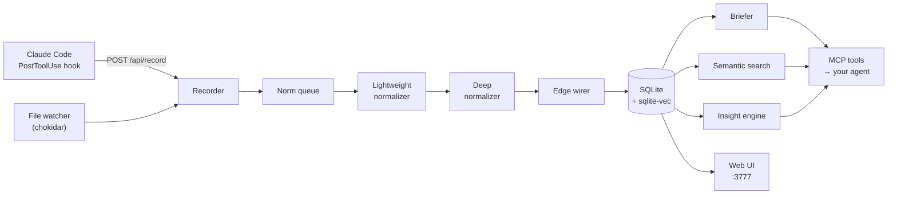

# Simple Rick

**Persistent memory for AI coding agents.**

Every coding session with an AI agent starts from zero. You re-explain the architecture, re-justify the decision you already made three weeks ago, and re-discover the bug you already fixed once. The transcript exists, but it is a wall of text nobody — human or model — reads back.

Simple Rick is an MCP server that sits next to your agent and fixes that. It records what actually happens in a session, normalizes it into structured chunks with embeddings, wires the chunks into a graph, and hands the relevant part back at the start of the next session.

Everything runs locally. SQLite file in your project, no external database, no telemetry.

> **Status: alpha.** It works and it is used, but it has rough edges — see [Known limitations](#known-limitations). Interfaces may change.

---

## How it works



Two things feed the pipeline: a **hook** that reports every tool call your agent makes, and a **file watcher** that captures diffs with millisecond timestamps. Both land in the recorder, which writes raw turns crash-safely.

A **background queue** drains those turns without blocking your session. The lightweight normalizer classifies intent and domain cheaply; the deep normalizer summarizes and embeds; the edge wirer connects new chunks to related existing ones. The result is a small knowledge graph, not a transcript.

At the start of the next session, the **briefer** reads that graph and gives your agent a briefing instead of a blank slate.

---

## Quickstart

Requires Node.js 20+.

```bash
git clone https://github.com/good-v1be/simple-rick.git
cd simple-rick
npm install
npm run build
```

### 1. Give it an AI provider

Simple Rick needs one provider for embeddings and one for chat completion. It auto-detects from the environment, first match wins:

| Environment variable | Embeddings | Chat |
|---|---|---|
| `OPENAI_API_KEY` | OpenAI | OpenAI |
| `GOOGLE_API_KEY` | Google | Gemini |
| `MISTRAL_API_KEY` | Mistral | Mistral |
| `ANTHROPIC_API_KEY` + `VOYAGE_API_KEY` | Voyage | Claude Haiku |

Anthropic has no embedding model, which is why it needs Voyage alongside it.

### 2. Register it as an MCP server

In your project's `.mcp.json`:

```json
{
  "mcpServers": {
    "simple-rick": {
      "command": "npx",
      "args": ["tsx", "/absolute/path/to/simple-rick/src/server/index.ts"],
      "env": {
        "PROJECT_PATH": ".",
        "OPENAI_API_KEY": "${OPENAI_API_KEY}"
      }
    }
  }
}
```

### 3. Install the recorder hook

Without this, Simple Rick only sees file changes — not what your agent actually did. Copy `hooks/simple-rick-recorder.js` somewhere permanent and register it as a `PostToolUse` hook in `~/.claude/settings.json`:

```json
{
  "hooks": {
    "PostToolUse": [
      {
        "matcher": "Bash|Edit|Write|MultiEdit",
        "hooks": [
          { "type": "command", "command": "node /path/to/simple-rick-recorder.js" }
        ]
      }
    ]
  }
}
```

The hook is fire-and-forget: it never blocks your agent, and it silently does nothing when Simple Rick is not running.

### 4. Use it

Start a session and call `simple_rick_init` once to seed the project context. From then on, open each session with `simple_rick_briefing` and close it with `simple_rick_close`.

---

## MCP tools

| Tool | What it does |
|---|---|
| `simple_rick_init` | One-time setup. Scans the codebase, extracts implicit architecture decisions from the code and git history, and seeds the initial context. |
| `simple_rick_briefing` | **Call at session start.** Returns project context, open issues, learnings and recommendations. Takes an optional `focus` to narrow it down. |
| `simple_rick_close` | **Call at session end.** Drains the queue: normalizes message pairs, extracts learnings, creates embeddings. |
| `simple_rick_search` | Semantic search across the whole project history. Filterable by intent (`bugfix`, `refactor`, `architecture_decision`, …). |
| `simple_rick_ask` | Ask a question about the code, past decisions, or how things connect. |
| `simple_rick_decision` | Explicitly record an architecture decision with rationale and rejected alternatives. |
| `simple_rick_link` | Manually cross-link two chunks or concepts. |
| `simple_rick_insights` | Mine the knowledge base for correlations, trends and anomalies, validated by an LLM. Modes: `deep`, `semantic`, `chains`, `all`. |

---

## Web UI

The server also exposes a local flow visualization on **http://127.0.0.1:3777** showing the pipeline live and the resulting graph. It is protected by a bearer token generated on first run; the URL including the token is printed by `simple_rick_briefing`.

REST endpoints: `GET /api/graph`, `GET /api/sessions`, `POST /api/record`.

---

## Where your data lives

Everything sits in `.simple-rick/` inside your project:

```
.simple-rick/
  simple-rick.db   SQLite: sessions, turns, chunks, edges, embeddings (sqlite-vec)
  .token           bearer token for the local HTTP server (mode 0600)
```

Simple Rick adds `.simple-rick/` to your `.gitignore` on first run. Nothing is sent anywhere except to the AI provider you configured, for normalization and embeddings.

**Be aware of the size.** Full recording is not cheap on disk — a heavy multi-day project can produce a database in the hundreds of megabytes.

---

## Development

```bash
npm run dev     # tsx watch
npm run build   # compile to dist/
npm run lint    # tsc --noEmit
npm test        # vitest (11 unit + integration tests)
```

There is also an end-to-end suite in `e2e/` that drives real Claude Code CLI sessions against the server to exercise every MCP tool:

```bash
python3 e2e/test_mcp_e2e.py        # requires the `claude` CLI and a configured provider
```

It is not wired into `npm test` because it costs real API calls.

---

## Known limitations

Honest list, so nobody is surprised:

- **No migration system.** The schema is applied inline in `src/server/db/sqlite.ts`, with ad-hoc `ALTER TABLE` calls and no version table.
- **Switching embedding provider breaks existing vectors.** The dimension is stored on first run but not validated afterwards. If you switch, drop the `chunk_embeddings` and `note_embeddings` tables and let them re-embed.
- **AI output is parsed by regex, not validated.** Malformed JSON from the model silently becomes an empty object.
- **Errors are often swallowed.** Several `catch` blocks discard the error without logging, which makes debugging harder than it should be.
- **Hardcoded limits.** Max file size (50 KB), max files scanned (500) and the queue throttle are constants, not configuration.
- **Only tested against Claude Code.** The MCP interface is standard, but the recorder hook is written for Claude Code's hook format.

---

## License

MIT — see [LICENSE](LICENSE).
